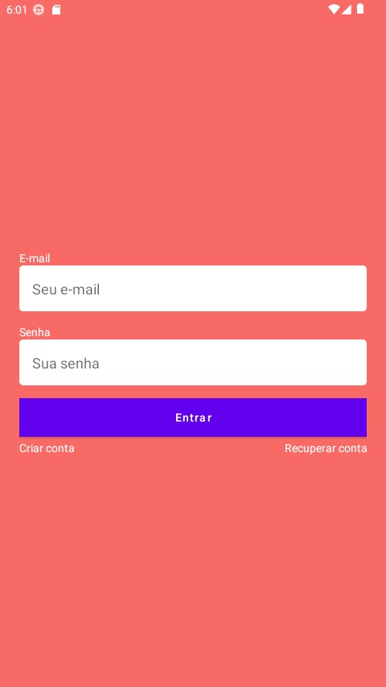
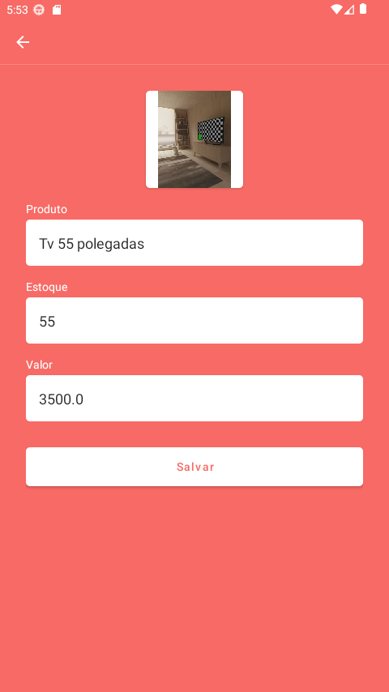

<h1 align="center">
    Controle de estoque
</h1>
 

<h4 align="center">
  📊Controle de estoque
</h4>

Telas do App

    
    
    

## :rocket: Tecnologias

Esse projeto foi desenvolvido com as seguintes tecnologias:

- Java
- [Firebase](https://firebase.google.com/?hl=pt-br)
- [Picasso](https://square.github.io/picasso/)

## 💻 Projeto

~ App para controle de estoque usando firebase e sqlite  
~ App desenvolvido com o intuito de aperfeiçoar as minhas habilidades com desenvolvimento nativo 
e aprender também Firebase, esse projeto usou o Realtime database, Storage database e o authentication 
~ Nele foi implementado recuperação de senha com estrutura customizada enviada por email para o usuario, salvar imagens dos produtos,
login com email e senha, e update de informações ja existentes no banco do firebase.
